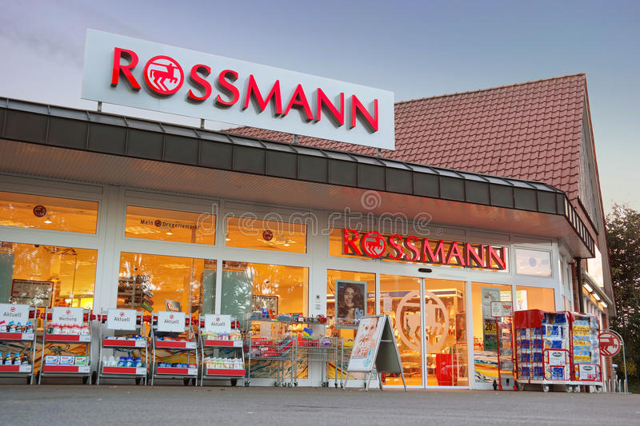
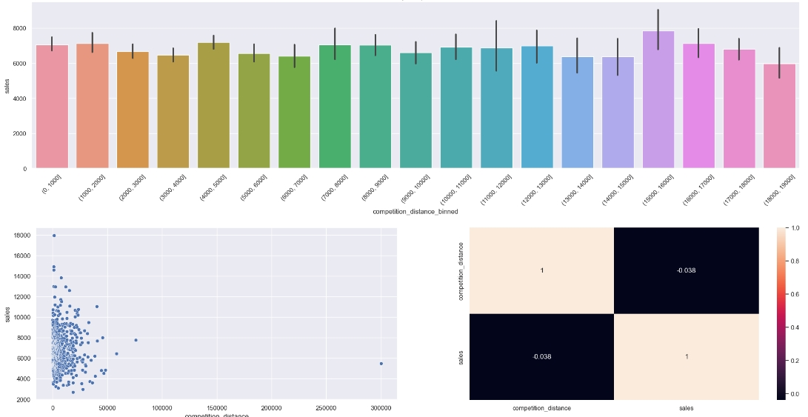
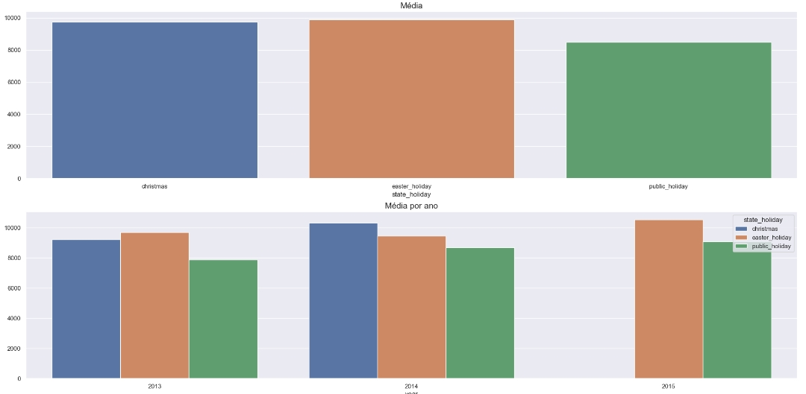

# Predição de Vendas para Rede de Farmácias Rossmann 

 

# 1. CONTEXTO

Rossmann é uma cadeia de farmácias que opera mais de 3.000 lojas em 7 países europeus. As lojas serão reformadas e o CFO precisa saber quanto pode ser investido em cada uma delas, para isso, ele precisa de uma previsão de quanto cada loja faturará nas próximas 6 semanas.

 

# 2. Estratégia de Solução

Utilizaremos o métodos CRISP-DM como estratégia de resolução da problemática, este tem como objetivo a resolução rápida de um problema, já sendo possível gerar valor para o cliente no primeiro ciclo.

Como solução será demonstrada um meio pelo qual o CFO poderá acessar a previsão individual de cada loja no seu smartphone.

# 3. Coleta de Dados

Os dados da loja foram coletados no [Kaggle](https://www.kaggle.com/c/rossmann-store-sales). 
Os dados contém as seguintes colunas:

| Atributos | Descrição |
| ------ | ------- |
| Store | Identificador único para cada loja |
| Sales | Volume de vendas no dia |
| Customers | Número de clientes no dia |
| Open | Indica se a loja está aberta ou fechada |
| StateHoliday | Indica feriado estadual |
| SchoolHoliday | Indica feriado escolar |
| StoreType | Tipo da loja |
| Assortment | Indica o nível de variedade de produtos da loja |
| CompetitionDistance | Distância em metros do concorrente mais próximo |
| CompetitionOpenSince | Mês e ano que abriu o concorrente mais próximo |
| Promo | Indica se está ocorrendo alguma promoção na loja |
| Promo2 | Indica se o prazo final da promoção foi extendido |
| Promo2Since | Indica mês e ano que a loja iniciou a Promo2 |
| PromoInterval | Indica os intervalos consecutivos em que a Promo2 é iniciada |

 

# 4. Análise Exploratória dos Dados (EDA)

Gerar Insights foi o objetivo princial dessa etapa. Para isso, foram utilizados algumas hipóteses criada pelo time de negócio.
Abaixo você poderá observar algumas dessas hipóteses validada por gráficos para um melhor entendimento.

**H1**. Lojas com maior sortimentos deveriam vender mais.

- **VERDADEIRA**. Lojas com maior diversidade de produtos vendem mais.

**H2** - Lojas com competidores mais próximos deveriam vender menos.
**FALSA**

 

**H6** - Lojas abertas durante o feriado de Natal deveriam vender mais.
- **VERDADEIRA** Dentre os feriados, o de natal e pascoa vendem mais.

 

# 5. Modelagem dos Dados

Nesta etapa, foi realizado o treinamento do algorítimo de Machine Learning, para isso, foram testados 5 algorítmos de Machine learning:

- Average Model (baseline)
- Linear Regression
- Lasso
- Random Forest
- XGBoost

Esta etapa foi dividido em duas partes. Na primeira, foi feito uma avaliação simples de cada modelo (Single Perfromance). E na segunda parte, foi utilizado o método de Cross Validation. 

Single Performance:

| Model Name | MAE | MAPE | RMSE |
|  --- | --- | --- | --- |
| Random Forest Regressor| 679.598831 | 0.099913 | 1011.119437 |
| XGBoost Regressor | 868.958205 | 0.130309 | 1238.550843 |
| Average Model | 1354.800353 | 0.206400 | 1835.135542 |
| Linear Regression | 1865.508533 | 0.292454 | 2671.455737 |
| Linear Regression - Lasso | 1868.179067 | 0.287900 | 2694.493111 |
 

Cross Validation Performance:

| Model Name | MAE | MAPE | RMSE |
| --- | --- | --- | --- |
| Linear Regression	| 2081.83 +/- 295.43 | 0.3 +/- 0.02	| 2954.51 +/- 467.88
| Lasso	2089.08 +/- 326.82 | 0.3 +/- 0.01 |	2990.57 +/- 499.1
| Random Forest Regressor |	836.61 +/- 217.1 | 0.12 +/- 0.02 | 1254.3 +/- 316.17
| XGBoost Regressor	1064.95 +/- 178.65 | 0.15 +/- 0.02 | 1519.92 +/- 242.12

Dentre os modelos testados o Random Forest Regressor obteve uma performance melhor que os outros algoritmos, porém por questões computacionar de processamento e tamanho do modelo, utilizarei o XGBoost.

# 6. Avaliação do Algoritmo

| store | predictions | worst_scenario | best_scenario | MAE | MAPE
| --- | --- | --- | --- |  --- | --- |
|	292	| 104582.81250 | 101252.462145 | 107913.162855 | 3330.350355 |	0.554214
|	909	| 232751.62500 | 225090.438986 | 240412.811014 | 7661.186014 |	0.513651
|	876 | 205953.12500 | 202059.084271 | 209847.165729 | 3894.040729 |	0.302213
|	595	| 366597.00000 | 362201.973329 | 370992.026671 | 4395.026671 |	0.297566
|	722	| 347086.71875 | 345254.537281 | 348918.900219 | 1832.181469 |	0.247925

| Scenario | Values
| --- | --- |
| predictions |	R$284,031,872.00
| worst_scenario |	R$283,319,667.11
| best_scenario | R$284,744,059.34

# 7. Deploy do modelo em produção

Após a validação o modelo, este foi publicado em um ambiente de nuvem para o CFO pudesse acessar de qualquer local diretamente do seu celular.

## 7.1 Resultado final com Bot no Telegram

> Esta API é responsável pela comunicação com o usuário final.
Uma vez que o usuário realizar uma consulta informando o ID da loja a qual deseja a previsão, o arquivo **_rossmann-bot.py_** carrega os dados de atributos da loja que agora estão em produção, realiza alguns tratamentos, o transforma em json, soma as predições e informa o usuário por meio de uma mensagem, o valor total das previsões de venda para as próximas 6 semanas 

Exemplo de funcionamento do bot:

 

 

## Contato

 [Linkedin](https://www.linkedin.com/in/rafaelcostati/).

